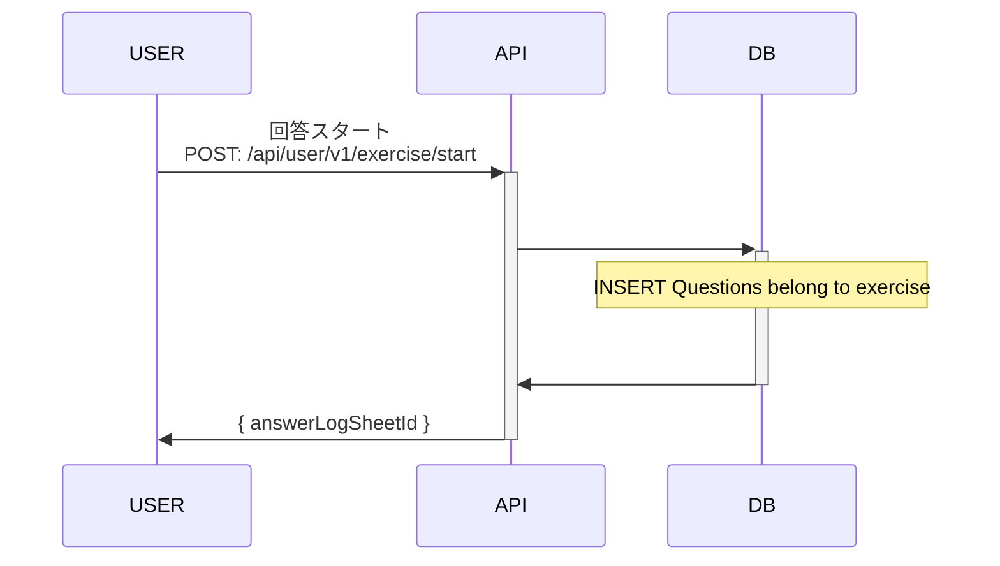

# トランザクション

## 問題集回答

### 初期状態:途中回答なし

```mermaid
sequenceDiagram
  participant USER
  participant API
  participant DB

  USER ->>+ API: 回答スタート<br>POST: /api/user/v1/exercise/start
  API ->>+ DB: <br>
  Note over DB: INSERT Questions belong to exercise
  DB ->>- API: <br>
  API ->>- USER: { answerLogSheetId }
```

### 初期状態:途中回答あり
